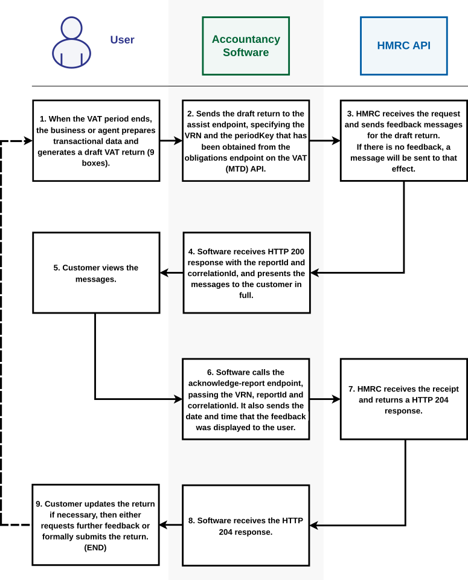

# HMRC Assist for VAT

HMRC Assist for VAT will be available from April 2027. It is a digital service, the [VAT Assist (MTD) API](/api-documentation/docs/api/service/mtd-transaction-risking), which supports customers submitting their VAT returns through the VAT (MTD) service. Its goal is to help customers to get their VAT returns right the first time.

## How HMRC Assist for VAT works

HMRC Assist for VAT analyses the information that is in a draft VAT return, before the return is submitted. Based on this information, it provides tailored feedback messages to the customer to help them complete the return. Additionally, the service includes links to helpful guidance on GOV.UK.

Messages are only presented when HMRC identifies a potential issue that warrants customer review.

**Note:** HMRC Assist is a rules-based service. It does not use artificial intelligence (AI) to analyse draft VAT returns or generate feedback messages. No human assessment of draft returns takes place either.

## Integrating HMRC Assist for VAT with your software

As a software provider, you can use the [VAT Assist (MTD) API](/api-documentation/docs/api/service/mtd-transaction-risking) to integrate HMRC Assist for VAT with your MTD-compatible product.

Customers or agents who use your software to submit draft VAT return information will then get appropriate feedback messages to support accurate VAT reporting. Therefore, when you request HMRC Assist feedback you will also submit the draft VAT return information.

Messages will relate to a return that is currently being prepared and will vary in complexity. They may relate to inconsistencies:

  * within an individual return
  * with sector trends
  * with other HMRC internal datasets
  * with third-party data that HMRC holds

HMRC will also look to detect anomalies within the return being prepared in the context of historical submissions.

## Customer journey

Your software can use the [VAT Assist (MTD) API](/api-documentation/docs/api/service/mtd-transaction-risking) to retrieve feedback for VAT return information after the figures are entered.

HMRC Assist will only be available:

  * for the current period, which has an open return obligation
  * when all the data that is required for the VAT return has been entered
  * before the VAT return is submitted

The software must then send through a confirmation once the messages have been displayed to the end user. 

To support HMRC Assist, the software must use both endpoints:

  * [Request HMRC Assist feedback for VAT](/api-documentation/docs/api/service/mtd-transaction-risking/1.0/oas/page#tag/Endpoints/operation/RequestVATAssistFeedback)
  * [Acknowledge HMRC Assist feedback for VAT](/api-documentation/docs/api/service/mtd-transaction-risking/1.0/oas/page#tag/Endpoints/operation/AcknowledgeVATAssistReport)

<a href="figures/hmrc-assist.svg" target="blank">Open the high-level diagram in a new tab</a>.

## Return submission

HMRC Assist only provides advisory feedback messages. It does not stop customers filing their VAT returns, whether they act on the messages or not.

Your software must:

  * allow customers to submit their VAT return, irrespective of any HMRC Assist submission feedback
  * if HMRC Assist is in use, enforce a temporary pause after requesting HMRC Assist feedback until the feedback is returned, before it allows the customer to submit their return

We recommend that:

  * you introduce relevant messaging to advise the customer during the pause that the software is waiting for feedback messages to be returned
  * you send the presentation receipt through automatically once all of the feedback has been displayed, for a smoother customer journey
  * you do not link HMRC Assist to the button that submits VAT returns, because it may cause confusion for customers
  * you disable the functionality for any period with a filed VAT return (use the *obligations* endpoint on the [VAT (MTD) API](/api-documentation/docs/api/service/vat-api) to determine the obligation status for a period)

## Handling feedback messages

HMRC Assist does not guarantee that a customer’s VAT return is accurate, even if they do not receive any feedback messages.

Customers are still responsible for making sure that the information that they provide is correct.

When messages are received from HMRC Assist:

  * they must not be modified by your software and must be displayed verbatim to businesses or agents
  * your software must use the HMRC feedback presented receipt endpoint to acknowledge that all of the feedback messages in the report have been displayed to the customer

Additional points to note:

  * HMRC Assist messages will be listed in order of priority. Feedback that has the greatest impact on a VAT return from an HMRC perspective will be first in the list. We recommend that your software preserves the order of the messages.
  * The service returns a maximum of five feedback messages. This limit is intended to prevent information overload and to ensure that only the most relevant and high-priority messages are presented to customers.
  * There is no limit on the number of times VAT Assist feedback can be requested prior to submission of a VAT return, although the feedback is unlikely to change unless the customer amends their draft return data.
  * We recommend that your software automatically repeats a request for feedback if any changes are made to the draft VAT return, to ensure that only relevant messaging is shown.
  * If a customer does not act on a feedback message, or if HMRC Assist determines that the feedback remains applicable, the same message will be re-issued.
